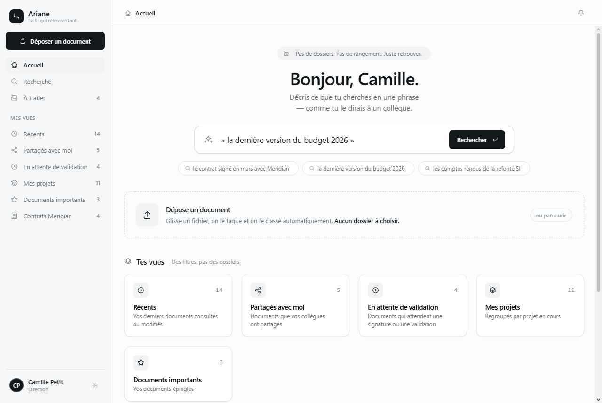

# Ariane

Ariane est un prototype web de GED sans dossiers. L'objectif de la maquette est de montrer une autre facon d'organiser les documents: non pas dans une arborescence rigide, mais avec des tags, des vues dynamiques et une recherche semantique.



## Promesse

Ariane explore une GED ou les documents ne sont plus ranges manuellement dans des dossiers. Ils sont deposes, enrichis par des tags, puis retrouves par contexte, intention ou vue metier.

## Fonctionnement de la maquette

- Depot de documents dans une interface dediee.
- Tagging IA simule pour suggerer des themes, statuts, clients, projets ou niveaux de priorite.
- Recherche semantique simulee pour retrouver des documents a partir d'une intention ou d'une question.
- Vues dynamiques pour composer des espaces de travail a partir des tags et metadonnees.
- Ecrans de demonstration pour le tableau de bord, la recherche, le depot, les vues et le detail document.

## Limites actuelles

- Prototype statique React charge directement dans le navigateur.
- Pas de backend.
- Pas de vraie IA.
- Pas de persistance serveur.
- Pas d'authentification.
- Donnees et comportements simules pour les besoins de la demonstration.

## Publication GitHub Pages

Le projet est volontairement garde en publication statique simple. React, ReactDOM et Babel sont charges depuis CDN, et les fichiers locaux sont references avec des chemins relatifs compatibles GitHub Pages.

Pour publier depuis la branche principale:

```bash
git init
git add .
git commit -m "Prepare Ariane for GitHub Pages"
git branch -M main
git remote add origin https://github.com/PadreFR/ariane-ged.git
git push -u origin main
```

Dans GitHub, activer ensuite GitHub Pages depuis `Settings > Pages`, avec la source `Deploy from a branch`, branche `main`, dossier `/root`.
